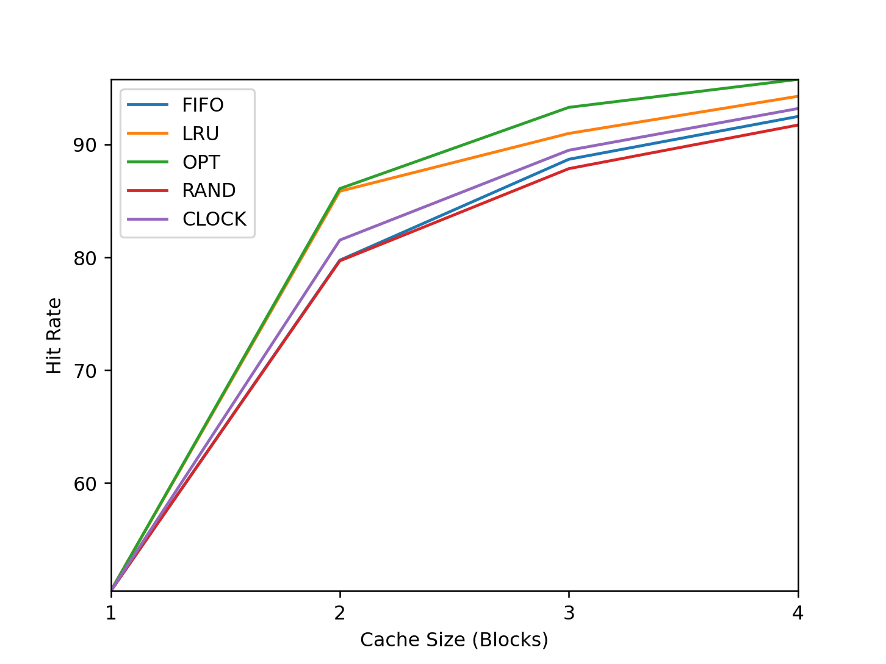

# Chapter 22. Beyond Physical Memory: Policies
## 1.
```
PS D:\study\operatingSystem\homework\vm-beyondphys-policy> python ./paging-policy.py -s 0 -n 10 -c
FINALSTATS hits 1   misses 9   hitrate 10.00

PS D:\study\operatingSystem\homework\vm-beyondphys-policy> python ./paging-policy.py -s 0 -n 10 -c --policy=LRU
FINALSTATS hits 2   misses 8   hitrate 20.00

PS D:\study\operatingSystem\homework\vm-beyondphys-policy> python ./paging-policy.py -s 0 -n 10 -c --policy=OPT
FINALSTATS hits 4   misses 6   hitrate 40.00
```
## 2.
```
PS D:\study\operatingSystem\homework\vm-beyondphys-policy> python ./paging-policy.py --addresses=0,1,2,3,4,5,0,1,2,3,4,5 --policy=FIFO --cachesize=5 -c 
FINALSTATS hits 0   misses 12   hitrate 0.00

PS D:\study\operatingSystem\homework\vm-beyondphys-policy> python ./paging-policy.py --addresses=0,1,2,3,4,5,0,1,2,3,4,5 --policy=LRU --cachesize=5 -c 
FINALSTATS hits 0   misses 12   hitrate 0.00

PS D:\study\operatingSystem\homework\vm-beyondphys-policy> python ./paging-policy.py --addresses=0,1,2,3,4,5,0,1,2,3,4,5 --policy=MRU --cachesize=5 -c 
FINALSTATS hits 5   misses 7   hitrate 41.67
```
* 사용되는 page 수가 6가지이므로, 그에 맞게 cache size를 1 늘려주면 된다. 이 경우 처음 0~5까지 page는 miss하고 다음 0~5까지 page는 hit한다.

## 3.
```
python ./paging-policy.py -s 0 -n 10 -c --policy=UNOPT
FINALSTATS hits 0   misses 10   hitrate 0.00

python ./paging-policy.py -s 0 -n 10 -c
FINALSTATS hits 1   misses 9   hitrate 10.00

python ./paging-policy.py -s 0 -n 10 -c --policy=OPT
FINALSTATS hits 4   misses 6   hitrate 40.00

python ./paging-policy.py -s 0 -n 10 -c --policy=LRU
FINALSTATS hits 2   misses 8   hitrate 20.00

python ./paging-policy.py -s 0 -n 10 -c --policy=RAND
FINALSTATS hits 0   misses 10   hitrate 0.00

python ./paging-policy.py -s 0 -n 10 -c --policy=CLOCK
FINALSTATS hits 1   misses 9   hitrate 10.00
```
## 4.
* 다음을 이용해 address 순서를 생성하고 실행했다.
* generate-trace.py
```python
import random
import numpy as np
import os

np.random.seed(0)

addrList = list(np.random.randint(10, size=(10)))
addrList = ','.join(map(str, addrList)) 

print(f'addrList: {addrList}')

policies = ['LRU', 'RAND', 'CLOCK -b 0', 'CLOCK -b 1', 'CLOCK -b 3']
for policy in policies:
    cmd = f'python ./paging-policy.py --addresses={addrList} --policy={policy} -c'
    print(cmd)
    os.system(cmd)
```
```bash
PS D:\study\operatingSystem\homework\vm-beyondphys-policy> python .\generate-trace.py
addrList: 5,0,3,3,7,9,3,5,2,4
python ./paging-policy.py --addresses=5,0,3,3,7,9,3,5,2,4 --policy=LRU -c
ARG addresses 5,0,3,3,7,9,3,5,2,4
ARG addressfile
ARG numaddrs 10
ARG policy LRU
ARG clockbits 2
ARG cachesize 3
ARG maxpage 10
ARG seed 0
ARG notrace False

Solving...

Access: 5  MISS LRU ->          [5] <- MRU Replaced:- [Hits:0 Misses:1]
Access: 0  MISS LRU ->       [5, 0] <- MRU Replaced:- [Hits:0 Misses:2]
Access: 3  MISS LRU ->    [5, 0, 3] <- MRU Replaced:- [Hits:0 Misses:3]
Access: 3  HIT  LRU ->    [5, 0, 3] <- MRU Replaced:- [Hits:1 Misses:3]
Access: 7  MISS LRU ->    [0, 3, 7] <- MRU Replaced:5 [Hits:1 Misses:4]
Access: 9  MISS LRU ->    [3, 7, 9] <- MRU Replaced:0 [Hits:1 Misses:5]
Access: 3  HIT  LRU ->    [7, 9, 3] <- MRU Replaced:- [Hits:2 Misses:5]
Access: 5  MISS LRU ->    [9, 3, 5] <- MRU Replaced:7 [Hits:2 Misses:6]
Access: 2  MISS LRU ->    [3, 5, 2] <- MRU Replaced:9 [Hits:2 Misses:7]
Access: 4  MISS LRU ->    [5, 2, 4] <- MRU Replaced:3 [Hits:2 Misses:8]

FINALSTATS hits 2   misses 8   hitrate 20.00

python ./paging-policy.py --addresses=5,0,3,3,7,9,3,5,2,4 --policy=RAND -c
ARG addresses 5,0,3,3,7,9,3,5,2,4
ARG addressfile
ARG numaddrs 10
ARG policy RAND
ARG clockbits 2
ARG cachesize 3
ARG maxpage 10
ARG seed 0
ARG notrace False

Solving...

Access: 5  MISS Left  ->          [5] <- Right Replaced:- [Hits:0 Misses:1]
Access: 0  MISS Left  ->       [5, 0] <- Right Replaced:- [Hits:0 Misses:2]
Access: 3  MISS Left  ->    [5, 0, 3] <- Right Replaced:- [Hits:0 Misses:3]
Access: 3  HIT  Left  ->    [5, 0, 3] <- Right Replaced:- [Hits:1 Misses:3]
Access: 7  MISS Left  ->    [5, 0, 7] <- Right Replaced:3 [Hits:1 Misses:4]
Access: 9  MISS Left  ->    [5, 0, 9] <- Right Replaced:7 [Hits:1 Misses:5]
Access: 3  MISS Left  ->    [5, 9, 3] <- Right Replaced:0 [Hits:1 Misses:6]
Access: 5  HIT  Left  ->    [5, 9, 3] <- Right Replaced:- [Hits:2 Misses:6]
Access: 2  MISS Left  ->    [9, 3, 2] <- Right Replaced:5 [Hits:2 Misses:7]
Access: 4  MISS Left  ->    [9, 2, 4] <- Right Replaced:3 [Hits:2 Misses:8]

FINALSTATS hits 2   misses 8   hitrate 20.00

python ./paging-policy.py --addresses=5,0,3,3,7,9,3,5,2,4 --policy=CLOCK -b 0 -c
ARG addresses 5,0,3,3,7,9,3,5,2,4
ARG addressfile
ARG numaddrs 10
ARG policy CLOCK
ARG clockbits 0
ARG cachesize 3
ARG maxpage 10
ARG seed 0
ARG notrace False

Solving...

Access: 5  MISS Left  ->          [5] <- Right Replaced:- [Hits:0 Misses:1]
Access: 0  MISS Left  ->       [5, 0] <- Right Replaced:- [Hits:0 Misses:2]
Access: 3  MISS Left  ->    [5, 0, 3] <- Right Replaced:- [Hits:0 Misses:3]
Access: 3  HIT  Left  ->    [5, 0, 3] <- Right Replaced:- [Hits:1 Misses:3]
Access: 7  MISS Left  ->    [5, 0, 7] <- Right Replaced:3 [Hits:1 Misses:4]
Access: 9  MISS Left  ->    [5, 7, 9] <- Right Replaced:0 [Hits:1 Misses:5]
Access: 3  MISS Left  ->    [5, 9, 3] <- Right Replaced:7 [Hits:1 Misses:6]
Access: 5  HIT  Left  ->    [5, 9, 3] <- Right Replaced:- [Hits:2 Misses:6]
Access: 2  MISS Left  ->    [9, 3, 2] <- Right Replaced:5 [Hits:2 Misses:7]
Access: 4  MISS Left  ->    [9, 2, 4] <- Right Replaced:3 [Hits:2 Misses:8]

FINALSTATS hits 2   misses 8   hitrate 20.00

python ./paging-policy.py --addresses=5,0,3,3,7,9,3,5,2,4 --policy=CLOCK -b 1 -c
ARG addresses 5,0,3,3,7,9,3,5,2,4
ARG addressfile
ARG numaddrs 10
ARG policy CLOCK
ARG clockbits 1
ARG cachesize 3
ARG maxpage 10
ARG seed 0
ARG notrace False

Solving...

Access: 5  MISS Left  ->          [5] <- Right Replaced:- [Hits:0 Misses:1]
Access: 0  MISS Left  ->       [5, 0] <- Right Replaced:- [Hits:0 Misses:2]
Access: 3  MISS Left  ->    [5, 0, 3] <- Right Replaced:- [Hits:0 Misses:3]
Access: 3  HIT  Left  ->    [5, 0, 3] <- Right Replaced:- [Hits:1 Misses:3]
Access: 7  MISS Left  ->    [5, 0, 7] <- Right Replaced:3 [Hits:1 Misses:4]
Access: 9  MISS Left  ->    [5, 7, 9] <- Right Replaced:0 [Hits:1 Misses:5]
Access: 3  MISS Left  ->    [7, 9, 3] <- Right Replaced:5 [Hits:1 Misses:6]
Access: 5  MISS Left  ->    [7, 3, 5] <- Right Replaced:9 [Hits:1 Misses:7]
Access: 2  MISS Left  ->    [7, 5, 2] <- Right Replaced:3 [Hits:1 Misses:8]
Access: 4  MISS Left  ->    [5, 2, 4] <- Right Replaced:7 [Hits:1 Misses:9]

FINALSTATS hits 1   misses 9   hitrate 10.00

python ./paging-policy.py --addresses=5,0,3,3,7,9,3,5,2,4 --policy=CLOCK -b 3 -c
ARG addresses 5,0,3,3,7,9,3,5,2,4
ARG addressfile
ARG numaddrs 10
ARG policy CLOCK
ARG clockbits 3
ARG cachesize 3
ARG maxpage 10
ARG seed 0
ARG notrace False

Solving...

Access: 5  MISS Left  ->          [5] <- Right Replaced:- [Hits:0 Misses:1]
Access: 0  MISS Left  ->       [5, 0] <- Right Replaced:- [Hits:0 Misses:2]
Access: 3  MISS Left  ->    [5, 0, 3] <- Right Replaced:- [Hits:0 Misses:3]
Access: 3  HIT  Left  ->    [5, 0, 3] <- Right Replaced:- [Hits:1 Misses:3]
Access: 7  MISS Left  ->    [5, 3, 7] <- Right Replaced:0 [Hits:1 Misses:4]
Access: 9  MISS Left  ->    [5, 7, 9] <- Right Replaced:3 [Hits:1 Misses:5]
Access: 3  MISS Left  ->    [7, 9, 3] <- Right Replaced:5 [Hits:1 Misses:6]
Access: 5  MISS Left  ->    [7, 3, 5] <- Right Replaced:9 [Hits:1 Misses:7]
Access: 2  MISS Left  ->    [7, 5, 2] <- Right Replaced:3 [Hits:1 Misses:8]
Access: 4  MISS Left  ->    [7, 2, 4] <- Right Replaced:5 [Hits:1 Misses:9]

FINALSTATS hits 1   misses 9   hitrate 10.00

```

## 5.
* valgrind를 사용해 실제 trace 목록을 vpn.txt로 가공했다.
* transform.py
```python
traceFile = open('./ls-trace.txt', 'r')
vpnFile = open('./vpn.txt', 'w')

for line in traceFile:
    if (not line.startswith('=')):
        vpnFile.write(str((int("0x" + line[3:11], 16) & 0xfffff000) >> 12) + "\n")

traceFile.close()
vpnFile.close()
```

* plot.py
```python
import os
import subprocess
import matplotlib.pyplot as plt
import numpy as np
from tqdm import tqdm

cacheSizes = np.arange(1, 5)
policies = ["FIFO", "LRU", "OPT", "UNOPT", "RAND", "CLOCK"]
hitRates = []

for policy in tqdm(policies):
    hitRate = []
    for cacheSize in cacheSizes:
        result = subprocess.run(['python.exe', "./paging-policy.py", "-c", "-p", policy, 
            "-f", './vpn.txt', "-C", str(cacheSize)], stdout=subprocess.PIPE)
        result = result.stdout.decode('utf-8')
        # print(result[-9:-4])
        hitRate.append(float(result[-9:-4]))
    hitRates.append(hitRate)

print(hitRates)
for i in range(len(policies)):
    plt.plot(cacheSizes, hitRates[i])

plt.legend(policies)
plt.margins(0)
plt.xticks(cacheSizes, cacheSizes)
plt.xlabel('Cache Size (Blocks)')
plt.ylabel('Hit Rate')
plt.savefig('workload.png', dpi=227)
```
**결과**
